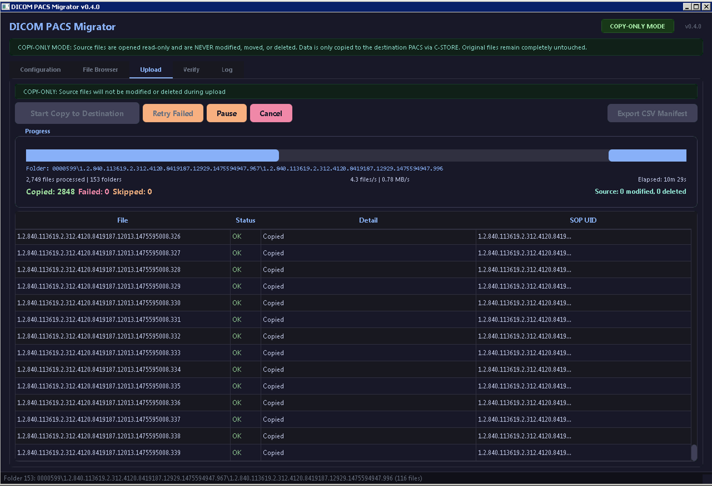

# DICOM PACS Migrator


> Production-grade DICOM filesystem-to-PACS migration tool with parallel workers, self-healing retry, bandwidth throttling, tag morphing, scheduling, TLS encryption, and post-migration verification. Copy-only architecture — source data is **NEVER** modified or deleted.



## Quick Start

```bash
git clone https://github.com/SysAdminDoc/dicom-pacs-migrator.git
cd dicom-pacs-migrator
python dicom_migrator.py  # Auto-installs all dependencies on first run
```

**Requirements:** Python 3.8+. All dependencies (`pydicom`, `pynetdicom`, `PyQt5`, `Pillow`, `pylibjpeg`) are auto-installed on first launch.

Or install manually first:

```bash
pip install -r requirements.txt
python dicom_migrator.py
```

## Build Standalone Executable

```bash
pip install pyinstaller
pyinstaller dicom_migrator.spec
```

The compiled exe lands in `dist/DICOM_PACS_Migrator.exe` — single file, no Python required on the target machine. The bootstrap auto-installer is automatically skipped in frozen executables.

## Why This Tool

Migrating DICOM data between PACS systems is a common but painful task in healthcare IT. Existing open-source tools are either command-line only, single-threaded, or require complex Docker/Java setups. Commercial tools cost thousands and lock you into vendor ecosystems.

This tool delivers enterprise-grade migration capabilities in a single Python file with a professional GUI — no Java, no Docker, no license keys.

## Features

| Feature | Description | Default |
|---------|-------------|---------|
| **Parallel Workers** | 1-16 concurrent persistent DICOM associations | 4 workers |
| **Self-Healing Retry** | Exponential backoff auto-retry waves for transient failures | 3 waves |
| **Fast Resume** | Directory-level manifest skip (200-400x faster than file-level) | Enabled |
| **Streaming Mode** | Walk + read + send per-directory, no pre-scan needed | Available |
| **Targeted Association Fallback** | Auto-negotiates dedicated association for SOP classes rejected by batch negotiation | Always on |
| **Bandwidth Throttle** | Token bucket rate limiter to protect production PACS | Disabled |
| **Migration Schedule** | Time-window auto-pause (e.g., migrate only 7PM-6AM) | Disabled |
| **Tag Morphing** | In-memory DICOM tag transforms (prefix, suffix, set, delete, strip_private) | Disabled |
| **TLS Encryption** | Encrypted DICOM associations for WAN/HIPAA-sensitive migrations | Disabled |
| **Post-Migration Verify** | C-FIND audit of destination with instance + series count matching | Available |
| **Storage Commitment** | Formal N-ACTION/N-EVENT-REPORT storage commitment verification | Available |
| **Modality/Date Filtering** | Staged migration by modality (CR/DX first) or date range | Disabled |
| **Patient ID Resolution** | Auto-resolve 0xFFFB conflicts via C-FIND + demographics remap | Enabled |
| **Pre-Flight Skip** | Query destination to skip studies already present | Enabled |
| **Decompress Fallback** | Auto-decompress JPEG/JPEG2000/RLE if destination rejects compressed syntax | Enabled |
| **Network Discovery** | Auto-scan subnet for DICOM nodes with C-ECHO probing | Available |
| **CSV/Report Export** | Manifest, verification, and summary report exports | Available |
| **Crash Recovery** | Atomic JSON manifest with resume from any interruption | Enabled |
| **DICOM Validation** | Rejects non-conformant files before sending | Always on |
| **High-DPI Aware** | Scales correctly on 4K/HiDPI displays | Always on |

## How It Works

```
┌─────────────────┐     ┌─────────────────────┐     ┌─────────────────┐
│  Source Folder   │────>│  Migration Engine    │────>│ Destination PACS │
│  (Read-Only)     │     │                     │     │                 │
│                  │     │  Tag Morphing        │     │  C-STORE SCP    │
│  DICOM files     │     │  Decompression       │     │                 │
│  never modified  │     │  Conflict Resolution │     │  Studies arrive │
│  never deleted   │     │  Bandwidth Throttle  │     │  verified via   │
│                  │     │  Schedule Window     │     │  C-FIND audit   │
└─────────────────┘     │  Parallel Workers    │     └─────────────────┘
                        │  Self-Healing Retry  │
                        └─────────────────────┘

Resume Manifest (JSON):
  - Tracks every file: sent/failed/skipped
  - Directory-level fast-skip on resume
  - Atomic writes prevent corruption
```

### Targeted Association Fallback

DICOM associations can negotiate at most 128 presentation contexts. When a batch contains many SOP classes, less common ones (Ultrasound, Structured Reports, Key Object Selection) can get squeezed out of the negotiation, causing `No presentation context` failures.

When this happens, the migrator automatically builds a fresh association containing *only* the rejected SOP class with every available transfer syntax. This gives it all 128 slots to negotiate a compatible syntax with the destination. After the file sends successfully, the broad association is re-established for the remaining batch. This happens transparently — you'll see `Sent via targeted assoc` in the log.

## Usage

### Basic Migration (Scan + Upload)

1. **Set source folder** — point to your DICOM image directory
2. **Configure destination** — enter PACS IP, port, AE titles (or use Connection Assistant)
3. **Scan** — enumerate and inspect all DICOM files
4. **Filter** — select patients, modalities, date ranges in the File Browser
5. **Upload** — start copy to destination with real-time progress

### Streaming Migration (Large Stores)

For multi-terabyte stores, use **Stream Migrate Entire Store** — walks, reads, and sends per-directory with no pre-scan. Starts sending immediately.

### Post-Migration Verification

After migration completes, switch to the **Verify** tab and click **Verify Migration**. The tool queries the destination PACS via C-FIND for every study in the manifest, comparing instance counts and series counts. Mismatches are flagged for re-migration.

## Configuration

### Bandwidth Throttle

Protect production PACS from migration overload:

| Setting | Recommendation |
|---------|---------------|
| 0 MB/s | Unlimited (dedicated migration window) |
| 10 MB/s | Conservative (shared clinical network) |
| 50 MB/s | Moderate (off-hours with some clinical load) |
| 100+ MB/s | Fast dedicated link |

### Migration Schedule

Set a time window for migration. The tool automatically pauses outside the window and resumes when it opens. Supports overnight windows (e.g., 19:00 to 06:00).

### Tag Morphing Rules

Apply DICOM tag transforms during migration. Source files are **never** modified — all transforms are in-memory only.

```
# One rule per line. Format: KEYWORD ACTION [VALUE]
InstitutionName set "New Hospital"
PatientID prefix MIG_
AccessionNumber suffix _2026
ReferringPhysicianName delete
strip_private
```

**Actions:** `set` (overwrite), `prefix` (prepend), `suffix` (append), `delete` (remove tag), `strip_private` (remove all private tags)

### Storage Commitment

For the highest level of assurance, use **Storage Commitment** from the Verify tab. This sends a formal DICOM N-ACTION request asking the destination PACS to confirm it has committed to permanently storing the migrated instances. Not all PACS support this — if your PACS doesn't, C-FIND verification provides equivalent confidence.

### TLS Encryption

For WAN migrations or HIPAA-sensitive environments, enable TLS encryption. Supports anonymous TLS (no client cert) or mutual TLS with CA/client certificates.

## Safety Guarantees

- **Source files are NEVER modified, moved, or deleted** — enforced at the architecture level
- **Read-only file access** — source files opened with `pydicom.dcmread()` only
- **In-memory transforms** — tag morphing, decompression, and conflict resolution modify only in-memory copies
- **No destructive operations** — zero `dcmwrite`, zero `os.remove`, zero `shutil.move` in the entire codebase
- **Atomic manifest writes** — crash at any point, resume without data loss
- **Destination-safe** — existing studies on the destination are detected and skipped, not overwritten

## Known Limitations

- **Single-file architecture** — everything is in one `.py` file. This is intentional for easy deployment but means the codebase is large (~3,900 lines).
- **Log output memory** — the GUI log pane accumulates text during long migrations. Use the "Clear Log" button periodically on very large runs, or export to file.
- **Manifest memory** — the JSON manifest is held in memory. At 1M+ files (~500MB RAM), this can be significant. Typical chiropractic/radiology PACS migrations (< 100K studies) are well within bounds.
- **Storage Commitment** — many PACS vendors don't implement the Storage Commitment Push Model. Falls back gracefully to C-FIND verification.
- **DICOMDIR** — the tool reads individual DICOM files from the filesystem, not DICOMDIR index files. Point it at the folder containing the actual `.dcm` files.
- **C-MOVE** — this is a C-STORE push tool. It does not support pulling via C-MOVE from a source PACS. You need filesystem access to the source data.

## Comparison with Other Tools

| Capability | This Tool | Orthanc | dcm4che storescu | Commercial |
|-----------|-----------|---------|------------------|------------|
| GUI | Full PyQt5 | Web UI | CLI only | Varies |
| Parallel workers | 1-16 concurrent | Single-threaded | Single | Varies |
| Self-healing retry | Exponential backoff waves | Manual | Manual | Varies |
| Fast resume | Directory-level skip | None | None | Basic |
| Bandwidth throttle | Token bucket rate limiter | None | None | Some |
| Tag morphing | set/prefix/suffix/delete/strip | Lua scripts | dcmmodify (separate) | Some |
| Schedule window | Auto-pause/resume | None | None | Some |
| TLS encryption | Built-in | Plugin | Built-in | Varies |
| Patient ID resolution | C-FIND + auto-remap | None | None | Some |
| Post-migration verify | C-FIND instance + series | None | None | Some |
| Storage commitment | N-ACTION formal verification | None | None | Some |
| Targeted assoc fallback | Auto for rejected SOP classes | N/A | N/A | N/A |
| Price | Free (MIT) | Free | Free | $$$$ |

## FAQ / Troubleshooting

**Q: How fast is it?**
With 4 workers on a gigabit LAN, expect 50-200+ files/second depending on PACS performance. The parallel architecture gives near-linear speedup up to the network or PACS bottleneck.

**Q: What if my migration gets interrupted?**
Resume is automatic. Re-run the same migration and it picks up where it left off, skipping all previously sent files via the manifest. Directory-level skip makes resume 200-400x faster than checking individual files.

**Q: Will this affect my production PACS?**
Enable bandwidth throttling and schedule windowing to minimize impact. The tool can limit throughput to any rate and auto-pause outside business hours.

**Q: I'm getting "No presentation context" failures.**
This typically means the destination doesn't support the SOP class or transfer syntax. The targeted association fallback (v1.0.1+) handles most of these automatically. If you still see failures with `Targeted assoc rejected`, the destination genuinely doesn't support that SOP class.

**Q: Does this work with [my PACS vendor]?**
If your PACS supports DICOM C-STORE SCP (which all PACS systems do), this tool works. Tested with dcm4chee, Orthanc, and commercial systems.

**Q: What about JPEG2000 or other compressed transfer syntaxes?**
The tool negotiates all standard transfer syntaxes. If the destination rejects a compressed syntax, it automatically decompresses in-memory and retries — source files remain untouched.

**Q: The UI looks tiny/squished on my 4K display.**
Update to v1.0.1+ which includes high-DPI scaling. If still an issue, set the environment variable `QT_SCALE_FACTOR=1.5` (or `2`) before launching.

## Contributing

Issues and PRs welcome. This is a single-file Python application — all code is in `dicom_migrator.py`.

## License

MIT License. See [LICENSE](LICENSE) for details.
