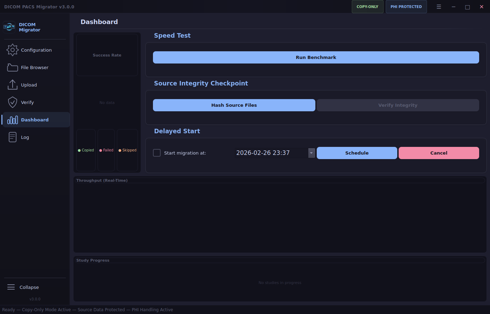
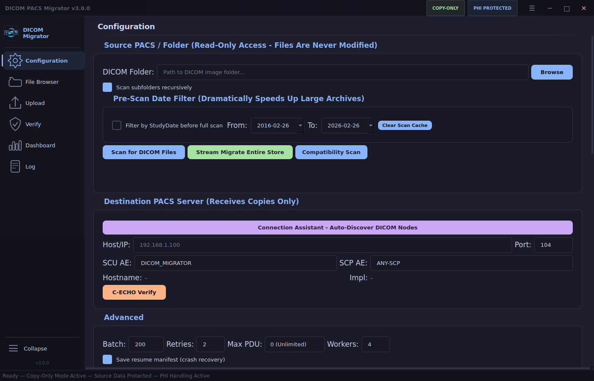

<h1 align="center">
  <br>
  
  <br>
  DICOM PACS Migrator
  <br>
</h1>

<p align="center">
  <b>DICOM C-STORE migration utility.</b>
</p>

<p align="center">
  
  
  
  
  
  
  
</p>

<p align="center">
  <a href="#quick-start">Quick Start</a> •
  <a href="#features">Features</a> •
  <a href="#how-it-works">How It Works</a> •
  <a href="#usage">Usage</a> •
  <a href="#configuration-reference">Configuration</a> •
  <a href="#hipaa--compliance">HIPAA</a> •
  <a href="#troubleshooting">Troubleshooting</a>
</p>

<p align="center">
  
  
  
</p>

---

## Quick Start

```bash
git clone https://github.com/SysAdminDoc/dicom-pacs-migrator.git
cd dicom-pacs-migrator
python dicom_migrator.py  # Auto-installs all dependencies on first run
```

No virtual environment, no pip install, no manual setup. The script bootstraps itself.

### Requirements

- Python 3.8+
- OS: Windows 10/11, Linux, macOS
- Network access to source DICOM files and destination PACS

Auto-installed dependencies: `PyQt5`, `pydicom`, `pynetdicom`, `numpy`, `Pillow`, `pylibjpeg`, `pylibjpeg-openjpeg`, `pylibjpeg-libjpeg`

---

## What It Does

Copies DICOM images from a local folder (or legacy PACS export) to a destination PACS server via standard DICOM C-STORE. Handles the real-world problems that simple C-STORE scripts can't, compressed syntax rejection, patient ID conflicts, dead associations, PACS backpressure, and transfers measured in hundreds of thousands of files across clinical hours.

### What It Does NOT Do

- **Never modifies source files** — files are opened read-only, never renamed, moved, or deleted
- **Never deletes from the destination** — sends copies only, no C-MOVE or C-GET
- **Not a PACS viewer** — no image rendering, no diagnostic display
- **Not a PACS server** — does not accept incoming associations or store data locally

---

## Features

### Core Migration

| Feature | Description | Default |
|---------|-------------|---------|
| Parallel Workers | 1–16 concurrent C-STORE associations | 4 workers |
| Streaming Mode | Walk + read + send per-directory without pre-scanning the entire folder tree | Button |
| Resume / Crash Recovery | JSON manifest tracks every file — restart exactly where you left off | Enabled |
| Study-Level Batching | Groups files by StudyInstanceUID for atomic study transfers | Enabled |
| Priority Queue | Right-click any study or patient during upload to move it to the front of the queue | Context menu |
| Pre-flight Duplicate Skip | C-FIND the destination before sending to skip studies that already exist | Checkbox |

### Error Recovery

| Feature | Description | Trigger |
|---------|-------------|---------|
| Decompress Fallback | In-memory decompression when destination rejects compressed transfer syntax | Automatic |
| Targeted Association | Builds a fresh AE with only the rejected SOP class and retries | Automatic |
| Patient ID Conflict (0xFFFB) | C-FIND destination for correct demographics, remap in-memory, resend | Automatic |
| 0xC000 "Cannot Understand" | 3-step recovery: strip private tags, decompress, targeted uncompressed association | Automatic |
| 0xA700 "Out of Resources" | Exponential backoff retry (2s, 4s, 8s) for PACS backpressure | Automatic |
| 0xA900 SOP Class Fallback | Reclassifies rejected files as Secondary Capture to salvage study data | Automatic |
| Dead Association Detection | Detects dropped associations and re-establishes before the next file | Automatic |
| Circuit Breaker | Trips after 5 consecutive failures, waits 60s, probes with single file before resuming | Automatic |
| Auto-Retry Waves | Re-sends transient failures in up to 5 waves with exponential backoff (30s to 300s) | Configurable |

### Throughput Control

| Feature | Description | Default |
|---------|-------------|---------|
| Unlimited PDU | Negotiates maximum PDU size on all association paths | 0 (Unlimited) |
| Bandwidth Throttle | Hard cap in MB/s to avoid saturating clinical links | Off |
| Adaptive Latency Throttle | Automatically backs off when PACS response time exceeds 1s | Checkbox |
| Time-of-Day Rate Control | Reduce workers and add inter-file delay during clinical hours (configurable peak window) | Off |
| Migration Schedule | Only run between configured start/end times — pauses outside the window | Off |

<details>
<summary><b>Pre-Migration Analysis</b></summary>
<br>

| Feature | Description |
|---------|-------------|
| **Pre-Migration Compatibility Scan** | Probe destination SOP classes + transfer syntaxes, cross-reference against every source file, show compatibility matrix |
| **Dry Run Mode** | Simulate entire migration without sending — validates files, checks TS compatibility, reports what *would* happen |
| **Speed Test Benchmark** | Send 5-10 representative files, measure actual throughput, estimate total migration time |
| **Source Integrity Checkpoint** | SHA-256 hash all source files before migration, verify unchanged after — cryptographic proof of copy-only mode |
| **Tag Morphing Preview** | Before/after diff table for a sample file when tag morphing rules are active |
| **DICOM Image Preview** | Thumbnail preview with window/level in the File Browser — confirm you're migrating the right studies |

</details>

<details>
<summary><b>Verification & Compliance</b></summary>
<br>

| Feature | Description |
|---------|-------------|
| Post-Migration C-FIND Audit | Queries destination for every study and compares instance counts |
| Auto-Verify | Triggers C-FIND verification immediately after upload completes |
| Storage Commitment (N-ACTION) | Formal DICOM Storage Commitment in batches of 500 instances |
| Transfer Syntax Probe | Pre-flight probe to discover what the destination actually accepts |
| Data Quality Report | Pre-migration analysis: missing tags, unsupported SOP classes, encoding issues |
| HIPAA Audit Logging | JSON-lines structured log of every file sent/failed with patient identifiers |
| CSV / Report Export | Export manifest, verification results, and full migration report |

</details>

<details>
<summary><b>Data Protection</b></summary>
<br>

| Feature | Description |
|---------|-------------|
| Copy-Only Architecture | Source files opened read-only — never modified, moved, or deleted |
| TLS 1.2+ Encryption | Optional TLS for DICOM associations with certificate and CA support |
| PHI-Aware Logging | All exports and logs carry PHI warnings — handle per HIPAA policy |
| In-Memory Only Modifications | Decompression, tag morphing, and patient ID remapping happen in-memory only |

</details>

<details>
<summary><b>Network & Configuration</b></summary>
<br>

| Feature | Description |
|---------|-------------|
| Connection Assistant | Subnet scanner with TCP port probe + C-ECHO verification — auto-populates settings |
| Connection Profiles | Save and load named connection profiles (host, port, AE titles) for quick switching between sites |
| Tag Morphing | Modify DICOM tags in-memory during transfer (set, prefix, suffix, delete, strip_private) |
| Modality / Date Filtering | Only send specific modalities (CR, DX, MR, CT...) or date ranges |
| TLS Client Certificates | Load cert chain + CA for mutual TLS authentication |
| Settings Persistence | All configuration saved and restored between sessions |
| Drag-and-Drop | Drop a folder onto the window to set the source path |

</details>

<details>
<summary><b>Scheduling & Multi-Target</b></summary>
<br>

| Feature | Description |
|---------|-------------|
| **Delayed/Scheduled Start** | "Start migration at 7:00 PM tonight" with live countdown timer in the UI |
| **Multi-Destination Fan-Out** | Send to 2+ PACS simultaneously (production + archive, or primary + DR site) |
| **PDF Migration Report** | Professional HTML report with study-level results, compliance attestation, and configuration details |

</details>

<details>
<summary><b>Monitoring & Notifications</b></summary>
<br>

| Feature | Description | Default |
|---------|-------------|---------|
| **Live Dashboard Tab** | Real-time throughput line chart (files/s + MB/s), success rate donut, per-study progress bars | Always on |
| ETA in Title Bar | Window title and taskbar show `47% - ETA 2:14:30` during migration | Always on |
| System Tray | Minimizes to tray with progress tooltip — double-click to restore | Enabled |
| Sound Notification | System chime on migration completion or failure | Enabled |
| Email Notification | SMTP email with migration summary on completion | Off |
| Webhook POST | JSON payload to any endpoint (Slack, Teams, custom) on completion | Off |
| Tray Notifications | Pop-up balloon from system tray on completion | Automatic |
| Migration History | Persistent log of all past migrations (File > Migration History) | Automatic |
| **Remote HTTP Monitor** | Tiny embedded web server with live dark-themed dashboard — check progress from your phone | Off |

</details>

<details>
<summary><b>Interface</b></summary>
<br>

| Feature | Description |
|---------|-------------|
| Colored Log | Error (red), warning (yellow), success (green), skip (orange) with color legend |
| Upload Table Filter | Search by patient name, ID, or description — filter by status (OK/FAIL/HEALED/REMAP) |
| Right-Click Copy | Copy any cell or entire row from the upload table to clipboard |
| About Dialog | Version, dependencies, Python version, GitHub link |
| Menu Bar | File menu with profiles and migration history, Help menu with About and GitHub link |

</details>

---

## How It Works

```
┌──────────────────────┐     ┌─────────────────────────┐     ┌──────────────────────┐
│   SOURCE FOLDER      │     │   DICOM PACS MIGRATOR   │     │   DESTINATION PACS   │
│   (Read-Only)        │     │                         │     │   (Receives Copies)  │
│                      │     │  ┌───────────────────┐  │     │                      │
│  DICOM files on      │────>│  │  Scanner Thread   │  │     │                      │
│  disk / NAS / USB    │ RO  │  │  (header parse)   │  │     │                      │
│                      │     │  └────────┬──────────┘  │     │                      │
│  NEVER modified      │     │           │             │     │                      │
│  NEVER deleted       │     │  ┌────────v──────────┐  │     │                      │
│                      │     │  │  Study Batcher    │  │     │                      │
└──────────────────────┘     │  │  + Priority Queue │  │     │                      │
                             │  └────────┬──────────┘  │     │                      │
                             │           │             │     │                      │
                             │  ┌────────v──────────┐  │     │                      │
                             │  │  Worker Pool      │  │     │                      │
                             │  │  (1-16 parallel)  │─────>  │  Stores copies       │
                             │  │                   │C-STORE │                      │
                             │  │  Circuit Breaker  │  │     │                      │
                             │  │  Adaptive Throttle│  │     │                      │
                             │  │  ToD Rate Control │  │     │                      │
                             │  └────────┬──────────┘  │     │                      │
                             │           │             │     │                      │
                             │  ┌────────v──────────┐  │     │                      │
                             │  │  Verify (C-FIND)  │─────>  │  Confirms counts     │
                             │  │  Storage Commit   │  │     │                      │
                             │  └───────────────────┘  │     │                      │
                             │                         │     │                      │
                             │  Manifest | Audit Log   │     │                      │
                             └─────────────────────────┘     └──────────────────────┘
```

### Error Recovery Flow

```
C-STORE attempt
  │
  ├─ 0x0000 Success ────────────────────────> Done
  ├─ 0xB000 Warning ────────────────────────> Done (stored with coercion)
  │
  ├─ Presentation Context Rejected ──┐
  │   1. Decompress in-memory        │
  │   2. Retry on existing assoc     │
  │   3. Targeted assoc (SOP-only)   │
  │   4. Uncompressed-only assoc     │
  │                                  │
  ├─ 0xFFFB Patient ID Conflict ──┐  │
  │   1. C-FIND destination       │  │
  │   2. Remap demographics       │  │
  │   3. Suffix fallback          │  │
  │                               │  │
  ├─ 0xC000 Cannot Understand ──┐ │  │
  │   1. Strip private tags     │ │  │
  │   2. Decompress + clean     │ │  │
  │   3. Targeted uncompressed  │ │  │
  │                             │ │  │
  ├─ 0xA700 Out of Resources    │ │  │
  │   Backoff: 2s, 4s, 8s       │ │  │
  │                             │ │  │
  ├─ 0xA900 SOP Mismatch        │ │  │
  │   Secondary Capture retry   │ │  │
  │                             │ │  │
  └─ Association Dead           │ │  │
      Re-establish + retry      │ │  │
                                v v  v
      All fail ─────────────────────────> Queued for auto-retry wave
```

---

## Usage

### Tab Workflow

1. **Configuration** — Set source folder, destination PACS host/port/AE titles, and toggle features
2. **File Browser** — Scan source folder, review patient/study/series tree, check/uncheck what to send
3. **Upload** — Start migration, monitor per-file progress with full patient metadata in a 9-column table
4. **Verify** — Post-migration C-FIND audit to confirm everything arrived
5. **Log** — Full operational log, exportable

### Streaming Mode (Large Migrations)

For migrations with 100K+ files where a full pre-scan would take too long:

1. Set source folder and destination in Configuration
2. Click **Stream Migrate** — the tool walks directories one at a time, scanning and sending per-folder
3. Resume manifest ensures crash recovery even mid-directory

### Tag Morphing

Modify DICOM tags in-memory during transfer. Source files are never changed.

```
InstitutionName set "New Hospital"
ReferringPhysicianName set "DR^SMITH"
InstitutionAddress delete
PatientID prefix "MIG_"
```

### Priority Queue

During an active upload, right-click any study or patient in the File Browser tab:

- **Prioritize Study** — all unsent files from that study jump to the front
- **Prioritize Patient** — all studies for that patient jump to the front

### Time-of-Day Rate Control

Reduce throughput during clinical hours to avoid impacting production PACS:

- Peak window: configurable (default 07:00 to 18:00)
- Peak workers: 1 to 4 (default 1)
- Peak delay: 0.0 to 10.0s between files (default 0.5s)
- Full speed resumes automatically during off-peak

---

## Upload Table Columns

The Upload tab shows full patient context for every file transferred:

| Column | Content |
|--------|---------|
| Patient Name | Blue clickable text — double-click to open file location in Explorer/Finder |
| Patient ID | DICOM PatientID |
| Mod | Modality (CR, DX, CT, MR, US, etc.) |
| Study Date | Formatted YYYY-MM-DD |
| Study Description | Study-level description from DICOM header |
| Series Description | Series-level description from DICOM header |
| SOP Class | Human-readable name (e.g. "Digital X-Ray", not the raw UID) |
| Status | Color-coded: **OK** (green) / **FAIL** (red) / **HEALED** (teal) / **REMAP** (purple) |
| Detail | Error messages, resolution methods, or transfer info |

All columns are user-resizable by dragging headers.

---

## Configuration Reference

### Connection Settings

| Setting | Description | Default |
|---------|-------------|---------|
| DICOM Folder | Source folder path (read-only access) | — |
| Host / IP | Destination PACS address | — |
| Port | DICOM port | 104 |
| AE Title (SCU) | Calling AE title for this tool | DICOM_MIGRATOR |
| AE Title (SCP) | Destination AE title | ANY-SCP |
| PDU Size | Maximum Protocol Data Unit | 0 (Unlimited) |

### Transfer Options

| Option | Description | Default |
|--------|-------------|---------|
| Workers | Parallel C-STORE associations (1 to 16) | 4 |
| Batch Size | Files per association before renegotiation | 50 |
| Retries | Per-file retry attempts before marking as failed | 1 |
| Auto-retry waves | Post-migration retry passes for transient failures | 3 |
| Conflict suffix | Suffix appended to PatientID when C-FIND resolution fails | _MIG |

---

## HIPAA / Compliance

### PHI Handling

The following artifacts **contain Protected Health Information**:

| Artifact | Contents | Location |
|----------|----------|----------|
| Migration Manifest | Patient names, IDs, study dates, descriptions | `~/.dicom_migrator/` |
| HIPAA Audit Log | Per-file patient identifiers, timestamps, status | User-specified path |
| CSV Export | Full manifest with all patient metadata | User-specified path |
| Application Log | Patient names in status messages | In-memory / export |

**Handle all exports in accordance with your organization's HIPAA security policies. Encrypt at rest when possible.**

### Audit Log Format

JSON-lines format, one event per line:

```json
{"timestamp": "2026-02-20T14:30:00", "event": "file_sent", "sop_uid": "1.2.3...", "patient": "DOE^JOHN", "patient_id": "12345", "status": "success"}
```

---

## Troubleshooting

### Association rejected on every file

- Verify the destination AE title matches exactly — it is case-sensitive on many PACS systems
- Confirm the destination PACS is configured to accept connections from your SCU AE title
- Use the **Connection Assistant** to scan for the PACS and auto-populate settings
- Try a **C-ECHO test** first to verify basic connectivity

### Files rejected with 0xC000

The destination cannot parse the file. The tool automatically attempts three recovery steps: stripping private tags, decompressing pixel data, and opening a targeted uncompressed-only association. If all three fail, the file has a structural issue — check the Log tab for specifics.

### Patient ID conflicts (0xFFFB)

A study already exists on the destination under different patient demographics. The tool queries the destination via C-FIND to discover the correct demographics, remaps the in-memory dataset to match, and resends. If C-FIND is unavailable or returns nothing, it falls back to appending a configurable suffix.

### Migration seems slow

- Increase workers in the Configuration tab (Workers spinner, up to 16)
- Check the Log tab for adaptive throttle messages — it may be auto-limiting based on PACS latency
- Disable the bandwidth throttle if your network has capacity
- If running during clinical hours, Time-of-Day rate control may be reducing throughput
- Verify PDU size is set to `0 (Unlimited)` — small PDU sizes dramatically reduce throughput

### Resume after crash

Click **Start Copy** again with the same source folder. The manifest automatically detects previously sent files and skips them instantly. No reconfiguration needed.

---

## Building a Standalone Executable

```bash
pip install pyinstaller
pyinstaller --onefile --windowed --clean \
    --name "DICOMPACSMigrator" \
    --hidden-import "pydicom" \
    --hidden-import "pynetdicom" \
    --hidden-import "numpy" \
    --hidden-import "PIL" \
    --hidden-import "pylibjpeg" \
    --collect-all pydicom \
    --collect-all pynetdicom \
    --exclude-module tkinter \
    --exclude-module matplotlib \
    dicom_migrator.py
```

Output: `dist/DICOMPACSMigrator.exe` (Windows) or `dist/DICOMPACSMigrator` (Linux/macOS).

**Critical PyInstaller notes:**
- Never `--exclude-module=logging` — PyQt5 crashes without it
- Lazy imports inside functions need explicit `--hidden-import`
- `--collect-all pydicom` ensures all transfer syntax handlers are bundled

---

## Contributing

Issues and PRs welcome. This tool is actively used in production medical imaging environments.

When submitting changes:

- Test against at least one real PACS (Orthanc, dcm4chee, Horos, or commercial)
- Maintain the copy-only guarantee — source files must never be modified
- Preserve HIPAA audit trail integrity
- Dark theme only

---

## License

[MIT License](LICENSE)

Copyright (c) 2026 SysAdminDoc
